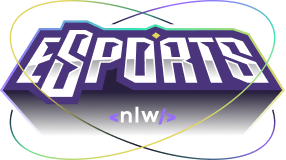
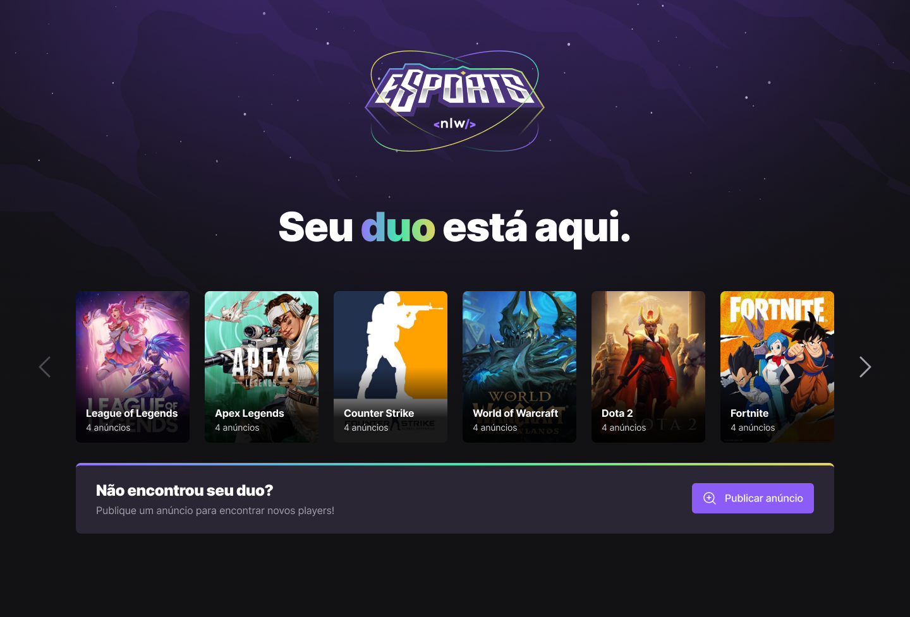
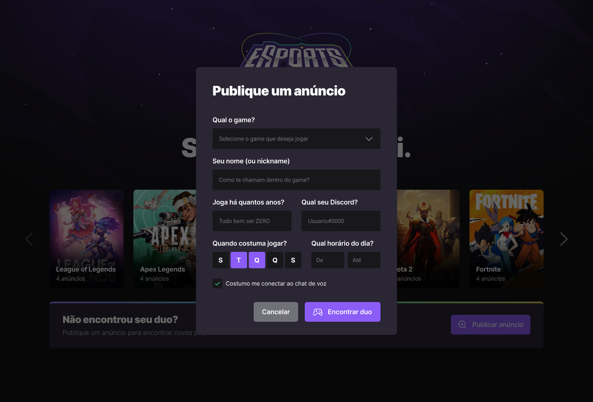

  

---

 Este projeto foi criado na semana NLW da rocketseat.
      

## 📝 Contents

- [Screen Shots](#screen_shots)
- [Built Using](#built_using)

## 🖼️ Screen Shots 

  

  

## ⛏️ Built Using 

- [ViteJS](https://vitejs.dev/) - Web Framework
- [Tailwindcss](https://tailwindcss.com/) - Css Framework
